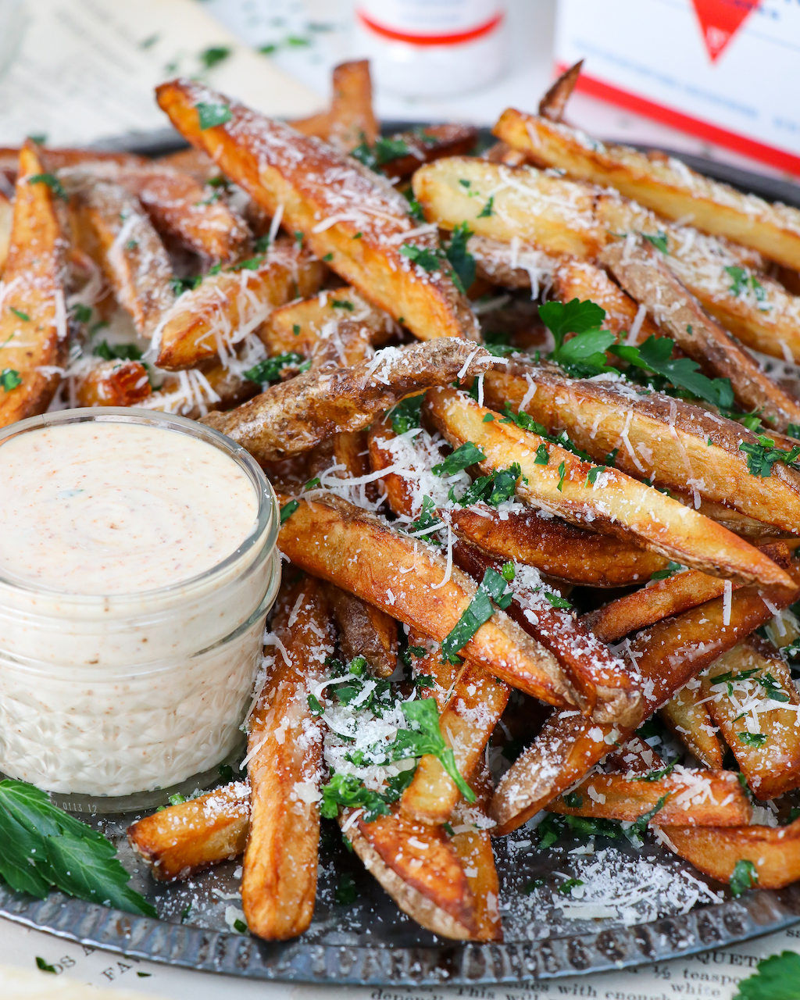

# Crispy Truffle Parmesan Fries

  

 

  

 

  

 

## Ingredients
- Large Russet Potatoes (4-6)
- Truffle Olive Oil (1/4 cup)
- Grated Parmesan (1/2 cup)
- Kosher Sea Salt (1 tbsp)
- Fresh Parsley (1-2 tbsp, chopped)
- Frying Oil

### Ingredients for the Garlic Chipotle Aioli
- Mayonnaise or Plain Greek Yogurt (1/4 cup)
- Garlic Clove (1, grated or pressed)
- Lemon Juice (1 lemon)
- Chipotle Powder (1/4 tsp)
- Kosher Sea Salt (1/4 tsp)
- Black Pepper (1/4 tsp)

## Instructions
1. **To Make the Aioli:** Simply combine all ingredients together. Adjust seasoning to taste. Store in the fridge until ready to serve.
2. **To Make the Fries:** Wash and slice the potatoes into French Fry strips. The thinner the fry, the crispier and faster cooking time.
3. Add the sliced fries into a large bowl of cold water. Let sit for 10-15 minutes.
4. Drain the fries and rinse with cold water for 2 minutes to remove any starch. Let the fries sit in a strainer to drain for 5 minutes.
5. Heat up a large pot of frying oil to 350°F.
6. Working in small batches, add the fries to fry for 3-5 minutes, until they begin taking on a lightly golden color. Use a slotted spoon to remove the fries to a paper towel-lined plate or wire rack.
7. *This is to make the fries crispy:* Working in small batches again, repeat the frying process for an additional 3-5 minutes, or until golden-brown.
8. While still warm, toss the fires in the truffle oil, grated parmesan, kosher sea salt, and chopped parsley.
