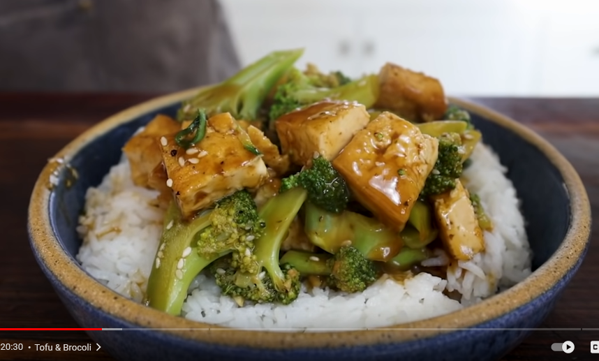

# Chicken & Broccoli

  

  

  

 

## Ingredients
| Ingredient | Quantity | Additional Notes |
| --- | --- | --- |
| Chicken Breast | 2 |
| Rice | 2 cups |
| Garlic | 2 cloves | finely chopped |
| Ginger | 1 small knob | finely chopped |
| Broccoli | 1 head |

 

### Ingredients for the Brown Sauce
| Ingredient | Quantity |
| --- | --- |
| Soy Sauce | 3 tbsp |
| Chinese Cooking Wine | 2 tbsp |
| Hoisin | 2 tbsp |
| Honey | 1 tbsp |
| Sesame Oil | 1 tbsp |
| Chicken Stock | 1/4 - 1/3 cup |
| Corn Starch | 1 tbsp |

## Instructions
1. Cook some rice in parallel
2. Place saute pan on medium heat
3. Fill a pot with water and bring it to simmer
4. Add oil to saute pan
5. Salt & pepper chicken
6. fry chicken in saute pan

## Veggies
1. Finely chop up 2 thumbs of ginger & 2 cloves of garlic
2. Slice off the flourettes of broccoli, cut to even pieces
3. Slice up the good half of the broccoli stem

## Brown Sauce
1. Whisk ingredients into a brown sauce

## Frying the Veggies
1. Take out chicken when cooked, add more oil if necessary, and fry the ginger & garlic
2. Simulataneously cook the broccoli in the pot with hot water
3. Once the ginger-garlic is toasted, add in the brown sauce and let thicken
4. Add broccoli once cooked
5. Add diced chicken to the mix

## Serving
1. Grab a bowl
2. Layer with cooked rice
3. Layer with cooked chicken & broccoli
4. Coat with more brown sauce as desired
