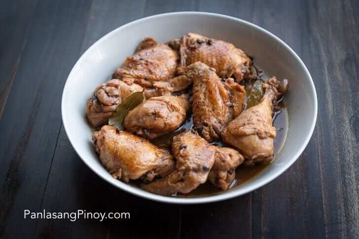

# Easy Chicken Adobo

  

  

 

  

 

## Ingredients
| Ingredient | Quantity | Additional Notes |
| --- | --- | --- |
| Chicken | 2 lbs | *sliced into serving pieces* |
| Knorr Chicken Cube | 1 piece |
| Garlic | 1 head | *crushed* |
| White Vinegar | 6 TBSP |
| Soy Sauce | 6 TBSP |
| Whole Peppercorn | 1 ½ tsp |
| Dried Bay Leaves | 5 pieces |
| Water | ½ cup |
| Sugar | 1 tsp |
| Cooking Oil | 4 TBSP |

## Instructions
1. Combine chicken, ¼ of the total amount of garlic, whole peppercorn, dried bay leaves, soy sauce, vinegar, and water in a cooking pot. Cover and let boil. Stir and make sure that all ingredients are well blended.
2. Add Knorr Chicken Cube and sugar. Stir. Cover the pot and cook for 10 minutes.
3. Turn the chicken over and cook the opposite side for another 10 minutes. Set aside.
4. Heat oil in a clean pan. Sauté remaining garlic until it turns light brown.
5. Pan fry the chicken for 1 minute per side. Pour the adobo sauce into the pan. Boil until it reduces to half.
6. Transfer to a serving plate. Serve with warm rice.
