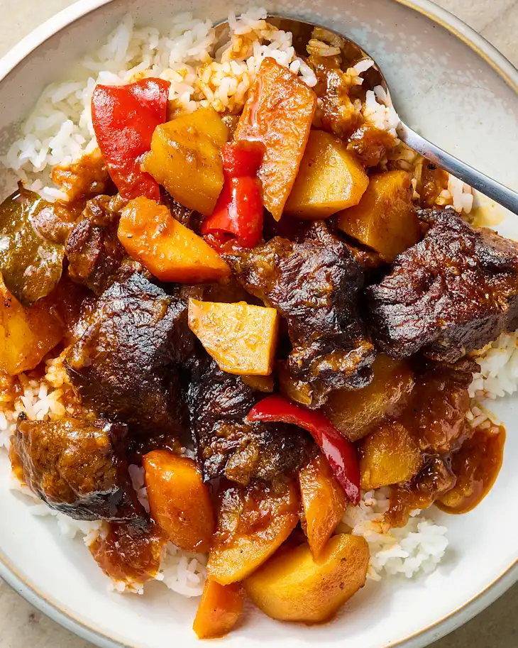

# Mechado (Filipino Beef Stew)

  

  

 

  

 

## Ingredients
| Ingredient | Quantity | Additional Notes |
| --- | --- | --- |
| Cooking Oil | 1 TBSP | Canola or similar |
| Boneless Beef Chuck Roast | 3 lbs | trimmed and cut into 1 ½ inch pieces |
| Yellow Onion | 1 medium | thinly sliced (about 2 cups) |
| Garlic | 5 cloves | minced |
| Water | 3 cups |
| Tomato Sauce | 15 oz can |
| Soy Sauce or Tamari | ⅓ cup |
| Brown Sugar | 1 TBSP |
| Dried Bay Leaves | 3 leaves |
| Ground Black Pepper | ¼ tsp |
| Yukon Gold Potatoes | 1 lb | about 2 large or 4 medium, peeled and cut into 1-inch pieces |
| Carrots | 8 oz | about 3 medium, peeled and cut crosswise into ½ inch pieces |
| Red Bell Pepper | 1 large | cut into 1-inch pieces (about 1 ½ cups)
| White Rice | | for serving |

### Key Ingredients in Mechado
- **Boneless beef chuck roast:** Trim the excess fat and cut into 1 1/2-inch pieces.
- **Aromatics:** Yellow onion and garlic build the foundation of flavor.
- **Vegetables:** Use a combination of Yukon Gold potatoes, carrots, and red bell pepper for the stew.
- **Tomato sauce:** This creates the rich, tangy base that mechado is known for.
- **Soy sauce:** Adds umami and savory flavor.
- **Bay leaves:** When simmered in the sauce, they add their signature aroma that ties the whole dish together.

### How to Make Mechado
1. **Sear the beef chuck.** Heat a bit of oil in a large Dutch oven over medium-high heat. Add the beef chuck roast pieces in batches and sear until browned on all sides. Transfer to a plate.
2. **Add aromatics and sauces.** Stir in the onion and garlic, cooking until softened and fragrant. Stir in the water, tomato sauce, soy sauce, brown sugar, bay leaves, black pepper, and seared beef.
3. **Cover and cook.** Reduce the heat to low, cover the pot, and let it simmer. You can also transfer the covered pot to the oven and let it braise.
4. **Add the vegetables.** Once the beef is nearly tender, add the potatoes, carrots, and red bell pepper. Continue cooking until the veggies are soft and the beef is very tender.
5. **Serve with rice.** Serve with steamed white rice and drizzle heavily with the sauce.

## Instructions
1. This recipe can be made entirely on the stovetop, or you can do Steps 5 and 7 in the oven. If using the oven, arrange a rack in the lower third of the oven and heat the oven to 325°F; make sure your pot is oven-safe.
2. Heat 1 tablespoon neutral oil in a large Dutch oven or heavy-bottomed pot over medium-high heat until shimmering. Add half of the boneless beef chuck roast pieces and sear, stirring occasionally, until browned all over, 6 to 8 minutes. Transfer to a large plate. Add the remaining beef to the pot and repeat searing. Transfer all of the beef to the plate.
3. Reduce the heat to medium. Add 1 thinly sliced medium yellow onion and 5 minced garlic cloves to the pot. Cook until the onion is softened, 4 to 5 minutes. Stir in 3 cups water, 1 (15-ounce) can tomato sauce, 1/3 cup soy sauce, 1 tablespoon packed brown sugar, 3 dried bay leaves, and 1/4 teaspoon black pepper. Scrape up any browned bits from the bottom of the pot.
4. Return the beef chuck roast pieces and their accumulated juices to the pot and stir to combine. Bring to a boil over medium-high heat.
5. Cover and transfer the pot to the oven, or cover and reduce the heat to maintain a simmer. Cook for 1 hour and 20 minutes.
6. Stir in 1 pound peeled and chopped Yukon Gold potatoes and 8 ounces peeled and chopped carrots. Scatter 1 chopped large red bell pepper over the top.
7. Cover and return to the oven, or bring back to a simmer and cover again. Cook until the beef is very tender, about 1 hour more.
8. Remove and discard the bay leaves if desired. Serve with steamed white rice.
