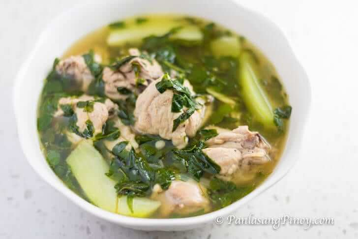

# Tinolang Manok

  

  

 

  

 

## Ingredients
| Ingredient | Quantity | Additional Notes |
| --- | --- | --- |
| Chicken | 2 lbs | *cut into serving pieces* |
| Malunggay Leaves | 1 cup |
| Hot Pepper Leaves | 1 cup |
| Ground Black Pepper | ⅛ tsp |
| Unripe Papaya | 1 piece | *wedged* |
| Water | 6 cups |
| Knorr Chicken Cube | 1 piece |
| Onion | 1 piece | sliced
| Garlic | 4 cloves | *crushed and chopped* |
| Ginger | 3 thumbs | *julienne* |
| Fish Sauce | 2 TBSP | *patis* |
| Vegetable Oil | 3 TBSP |

## Instructions
1. Heat oil in a pot.
1. Sauté garlic, onion, and ginger. Add the ground black pepper.
1. When the onion starts to get soft, add the chicken. Cook for 5 minutes or until it turns light brown.
1. Pour the water. Let boil. Cover and then set the heat to low. Boil for 40 minutes.
1. Scoop and discard the scums and oil on the soup.
1. Add the Knorr chicken cube and chayote or papaya. Stir. Cover and cook for 5 minutes.
1. Put the malunggay and hot pepper leaves in the pot and pour the fish sauce in. Continue to cook for 2 minutes.
1. Transfer to a serving bowl. Serve.
