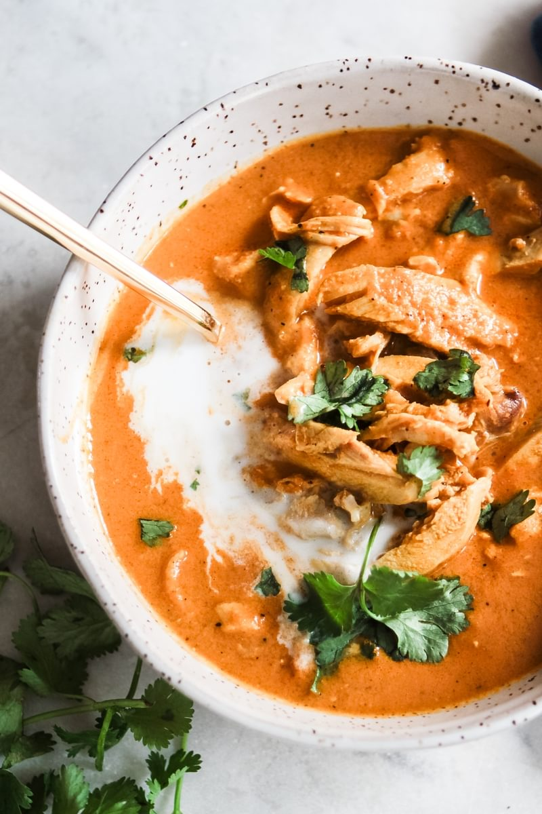

# Tikka Masala Soup

  

  

 

  

 

## Ingredients
| Ingredient | Quantity | Additional Notes |
| --- | --- | --- |
| Coconut Oil | 2 tbsp |
| Onion | 1 small | diced |
| Garlic Cloves | 3 cloves | minced |
| Cayenne Pepper | 1/2 tsp |
| Garam Masala spice mix | 1 tbsp |
| Ground ginger | 1 tsp |
| Cumin | 1/2 tsp |
| Tumeric | 1 tsp |
| Cinnamon | 1/2 tsp |
| Chicken Stock | 2 cups |
| Crushed tomatoes | 28 oz |
| Coconut milk (not lite) | 1 can |
| Kosher salt | 1-2 tsp |
| Shredded Chicken | 4 cups |
| Basil |

## Summary Instructions
1. Sauté garlic & onion in coconut oil
2. Bloom the spices
3. Pour in chicken stock, coconut milk, and tomatoes
4. Use an immersion blender to purée the soup until its creamy
5. Finish by adding shredded chicken and basil

## Detailed Instructions
1. Heat coconut oil over med-high heat in a heavy soup pot
2. Sauté the onion for 4 minutes, then add garlic for 3 more minutes
3. Add cayenne pepper, garam masala, ginger, cumin, tumeric, and cinnamon. Sauté for 3 minutes longer until spices are fragrant.
4. Add 2 cups of chicken stock, tomatoes, and coconut milk. Simmer for 30 minutes
5. Using an immersion blender, purée soup until smooth and creamy
6. Season with salt and add shredded chicken + garnish
