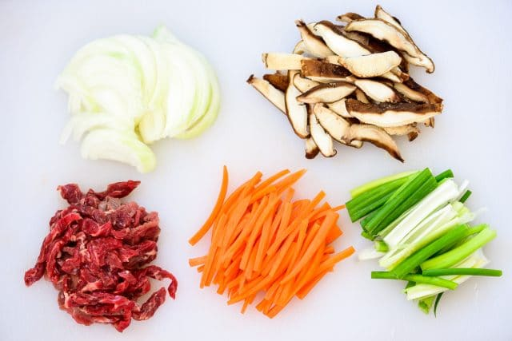
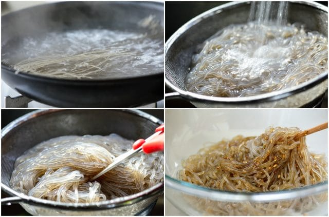
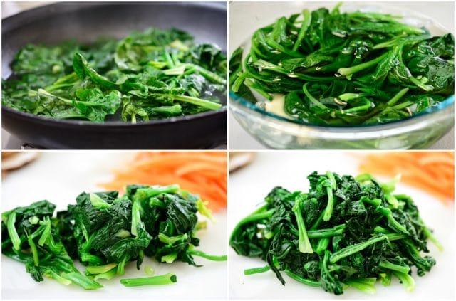
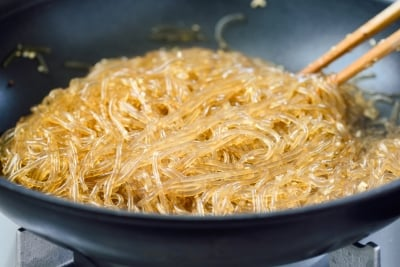
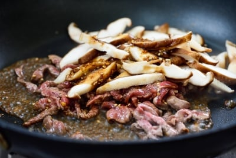
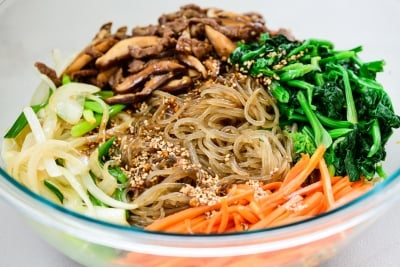

# Japchae (Stir-Fried Starch Noodles with Beef & Vegetables)
Rating: :star::star::star::star::star: /5  
[Recipe Link](https://www.koreanbapsang.com/japchae-korean-stir-fried-starch/)  

## Ingredients
- Korean Potato Starch Noodles (dangmyeon, 7 oz)
- Carrot (1 large carrot or about 3 oz)
- Onion, preferably sweet variety (1/2 of medium onion or 4-5 oz)
- Scallions (2)
- Lean Tender Beef (4 oz) (sirloin, chuck tender, rib eye, etc)
    - *[or pork loin]*
- Shiitake Mushrooms (3-4 oz) (or 4-5 dried shiitake, soaked until plump)
    - *or oyster mushrooms, wood ear mushrooms or button mushrooms*
- Fresh Spinach (6 oz, preferably a bunch of spinach)
- Oil for stir frying
- Salt
- Egg Garnish (jidan) - *optional*

### Sauce
- Soy Sauce (3.5 tbsp)
- Sugar (3 tbsp *or less if you want*)(use easy to mix sugar, not sugar crystals)
- Sesame Oil (2 tbsp)
- Minced Garlic (2 tbsp)
- Roasted Sesame Seeds (1 tbsp)
- Black Pepper (to taste)

## Instructions
1. Clean all the ingredients. Cut the carrot into matchsticks. Thinly slice the onion. Run the knife through the white parts of the scallions lengthwise, if thick, and then cut into about 2-inch long pieces. Remove the stems from the mushrooms, and slice into 1/4-inch thin strips. Cut the meat into thin 2-inch long strips.  
  
  
2. Combine all the sauce ingredients in a small bowl and mix well until the sugar is dissolved.  
  
  
3. In a large non-stick pan (see note 2), bring about 5 cups of water to a boil, and cook the noodles until completely translucent and soft (6 to 8 minutes). Drain in a strainer and rinse under cold running water. Drain well. Roughly cut the noodles with a pair of kitchen shears or a knife into 6 -7 inch lengths. Transfer to a large mixing bowl. Mix well with 3 tablespoons of the prepared sauce.  
  
  
4. Fill the same pan with 2 cups of water. When water boils, blanch the spinach only until wilted. Drain quickly and shock in cold water. Squeeze out water, run a knife through the squeezed spinach a couple of times, and lightly season with salt.  
  
  
5. Add 1/2 tablespoon of oil to the skillet, and stir fry the noodles over medium to medium high heat, stirring frequently, until translucent and a bit sticky (about 4 minutes). Transfer back to the mixing bowl.  
  
  
6. Add 1/2 tablespoon of oil to the pan, and stir fry the carrot over medium high heat, sprinkling with a pinch of salt. When the carrot sticks are half way cooked, about a minute, push them to one side of the pan to make room for the onion slices. Stir-fry the onion slices until translucent, sprinkling with a pinch of salt. Stir-in the scallion and cook briefly. Do not overcook. The vegetables should be crisp. Transfer to the bowl with the noodles.  
  
  
7. Add the beef and mushrooms along with 2 tablespoons of the prepared sauce and cook until the meat is cooked through, 2 - 3 minutes. Transfer to the bowl with the noodles.  
  
  
8. Add the spinach and the remaining sauce to the bowl with all other prepared ingredients. Toss well by hand. Adjust the seasoning to taste by adding a little more (start with 1/2 teaspoon) soy sauce and/or sugar as necessary.  
  

### Optional Egg Garnish
1. Separate the egg white and yolk. Lightly beat the white by gently cutting it with a spoon. Stir the yolk with a spoon until smooth. Heat a lightly oiled nonstick skillet over medium low heat. Pour each egg part into a thin layer, by tilting the skillet and/or spreading with a spoon. Cook each side briefly. (Do not brown the egg.) Roll it and thinly slice.  
 

## Notes
1. Shiitake and wood ear mushrooms are typical for japchae. Dried shiitake has a concentrated flavor and meatier texture. You can use any kind of fresh/dried mushrooms such as oyster mushrooms or button mushrooms.
2. In this updated recipe, you'll use the same pan for cooking the noodles and spinach and for stir-frying the noodles and other ingredients.
3. Leftover japchae should be kept refrigerated. Japchae reheats well in the microwave. The noodles will get soft and chewy again.
