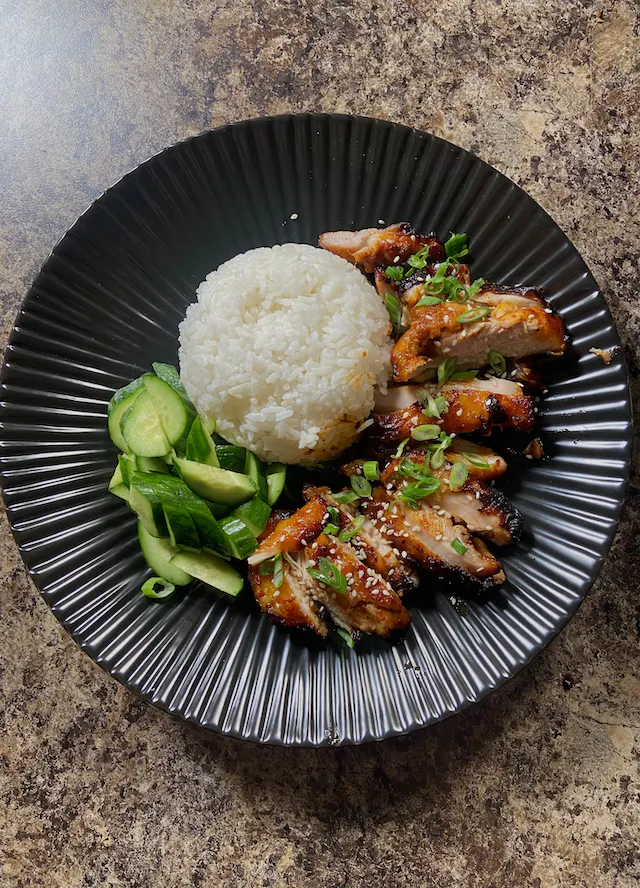

# Airfryer Spicy Gochujang Chicken

  

  

 

  

  

 

## Ingredients
*Number of Servings: 4*

| Ingredient | Quantity |
| --- | --- |
| Boneless Skin-on Chicken Thighs | 8 - 10 |
| Gochujang Paste | 4 tbsp |
| Gochugaru | 1 tbsp |
| Sesame Oil | 1 tbsp |
| Brown Sugar (or Honey) | 3 tbsp |
| Soy Sauce | 2 tbsp |
| Minced Garlic | 2 tbsp |
| Paprika | 2 - 3 tsp |
| Spray Cooking | - |
| Cooked Rice | - |
| Cucumbers | - |
| Sesame Seeds | - |
| Green Onions, Sliced | - |

## Instructions
1. Prepare your chicken by deboning the thighs and patting the skin dry.
2. Marinate with the ingredients below for 30mins-1 hr.
    - 4 tbsp gochujang paste
    - 1 tbsp gochugaru
    - 1 tbsp sesame oil
    - 3 tbsp brown sugar (or honey)
    - 2 tbsp soy sauce
    - 2 tbsp minced garlic
    - 2-3 tbsp paprika
3. Preheat airfryer to 400°F for 5-8 mins.
    - This ensures even cooking in the chicken and a juicier interior! Don't skip on this.
4. After preheating, spray the tray with nonstick oil and lay your chicken skin side down. Airfry for 6-7 mins.
5. Flip, and airfry for another 7-10 mins or until golden to your liking.
6. Serve over steamed rice, veggies, and garnish with sliced green onions and sesame seeds.
