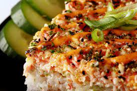

# Sushi Bake - Krizzia's Recipe

  

  

 

## Ingredients
| Ingredient | Quantity | Additional Notes |
| --- | --- | --- |
| Salmon | 3 fillets |
| Rice | 2 cups | jasmin white rice |
| Imitation Crab | 1 packet | *if available* |
| Sriracha |
| Kewpie Mayo |
| Cream Cheese | | *optional* |
| Rice Vinegar | 3 tbsp |
| Sugar | 3 tbsp | use easy to mix sugar, not sugar crystals |
| Salt | 1 tbsp |
| Furikake |
| Unagi Sauce |

## Instructions
1. Defrost the salmon
2. Cook the rice in a rice cooker with 2 cups of water
3. Bake the salmon at 350°F for about 7-9 minutes
4. Take out the salmon and shred it up in a bowl with imitation crab (if available) along with some sriracha & kewpie mayo (+ cream cheese / optional).
    - Coat the whole thing, up to preference for how much sauce is needed
5. In a separate bowl, combine 3 tbsp of rice vinegar with 3 tbsp of sugar and 1 tbsp of salt. Mix well. Possibly reheat to ensure the sugar melts.
6. Take rice and place it on the plexy glass, pour the rice vinegar solution over the mound of rice, toss it around & flatten it to disperse an even layer of rice.  
    - Guesstimate how much mixture to add because if you're using less rice, then you don't need as much.
7. Layering:
    - Rice
    - Furikake
    - Salmon/crab mixture
    - Furikake
8. Bake it at 400F-450F for 10-15 min
9. Take out of the oven and drizzle kewpie mayo, sriracha, and unagi sauce.
10. Put it back into the oven and broil on low for 2-3 minutes or until it's slightly toasted. **DO NOT BURN IT!**
11. Garnish with avocado and chopped cucumber
