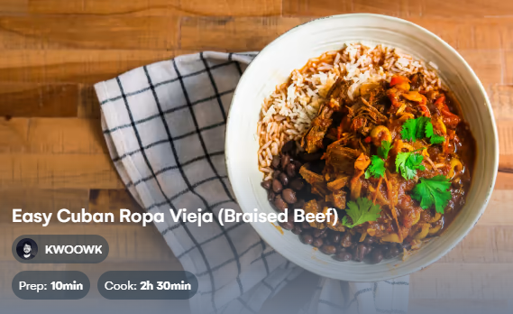

# Ropa Vieja

  

Rating: :star::star::star::star: /5  
[TikTok Link](https://www.tiktok.com/@letskwoowk/video/7128457768037666053?_r=1&_t=8VfMfXZ8Xpz&is_from_webapp=v1&item_id=7128457768037666053)  
[Recipe Link](https://recipe-integration.whisk.com/recipe-integration/view/107b008fa5d22394b32acc3f7575d17fcc9?utm_source=partner&utm_medium=tiktok&utm_campaign=recipe-integration)  

## Ingredients
- Oil (2 tbsp)
- Flank Steak (500g ~= 1.1 lbs)
- Onion (1 white or yellow)
- Garlic (8 cloves)
- Bell Peppers (3, red and/or yellow)
- Crushed Tomatoes (1 14 oz can)
- Tomato Paste (1 tbsp)
- Chicken Broth (500 mL)
- Salt
- Cumin (2 tbsp)
- Smoked Paprika (2 tbsp)
- Oregano (2 tbsp)
- Allspice (1/4 tbsp)
- Green Olives (sliced)
- Cilantro (for topping)

## Cooking the beef
1. Cut your flank steak into big pieces to fit in your pot/dutch oven. Cut against the grain for easy shredding later.
1. Season with (sea) salt and add to a high-heat pot/dutch oven coated with oil. Cook on both sides until just browned and remove the beef. We want to sear the meat, not fully cook it.

## Making the base
1. Add in sliced onion and sliced bell pepper, along with some (sea) salt. Stir fry until the onions are soft.
1. Add chopped garlic and *(Optionally) deglaze the pan with a splash of wine*. Stir fry for an additional minute.
1. Add tomato paste and your can of crushed tomatoes, follow by the chicken broth
1. Add all your seasonings and incorporate them before adding your browned steak back in.
1. Cover with a lid and let simmer for 2 hrs.
1. After 2 hrs, take out the steak and shred it using 2 forks. Then add the shredded beef back into the pot. Stir intermittently to ensure the bottom of the sauce does not burn.
1. Add green olives, and simmer everything for an additional 2-3 minutes.
1. Serve with rice and black beans.
