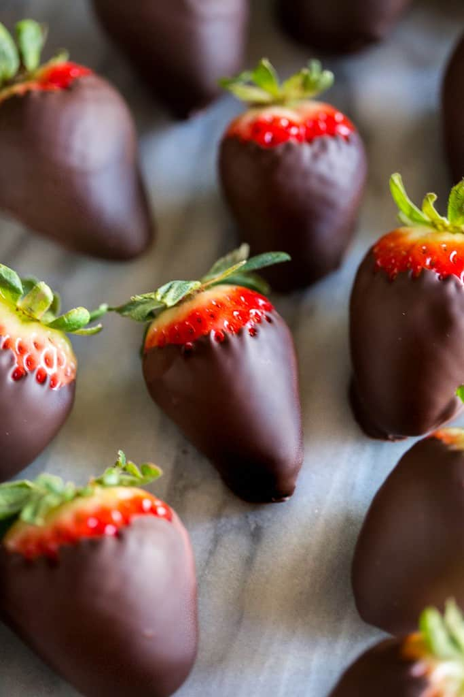

# Chocolate Covered Strawberries :chocolate_bar::strawberry:

  

Rating: :star::star::star::star::star: /5  
[Recipe Link](https://tastesbetterfromscratch.com/gourmet-chocolate-covered-strawberries/)  
The quality of chocolate is really important, so go with higher quality **Baking Chocolate** such as Ghirardelli baking chips or Baker's Baking Chocolate

## Tips for Perfect Chocolate Covered Strawberries
- **Pick good strawberries**
  - Choose firm, ripe strawberries without bruises and if possible, strawberries that are red all the way up to the stem
- **Use room temperature strawberries and DRY THEM really well**
  - Take the strawberries out of the fridge 15-30 minutes before dipping them. Wash them and gently dry them over with a paper towel
  - You want to make sure they're very dry, otherwise the chocolate won't set on them properly
- **Temper the chocolate**
  - Tempering the chocolate will help prevent the chocolate covered strawberries from looking streaky, gray, or dull after the chocolate sets. All you need to do to temper melted chocolate is set aside some of the chocolate to stir in at the end, after most of it has already been melted
    - Melt all but 1 heaping tbsp of the chocolate chips, and set the extra chips aside. Only add the reserved chocolate chips once most is melted and smooth

## Melt the chocolate
### Method 1: Over the Stovetop
1. Fill a saucepan 1/4 full with water and bring the water to a low gentle boil
2. Reduce the heat to the lowest setting and set a large (heat-proof) glass bowl on top, making sure the bowl tightly coveres the pot. Make sure there are a few inches of space between the bottom of the bowl and the water
3. Add chocolate to the bowl and stir *constantly* until melted and smooth
4. Remove the bowl from heat and add a handful of reserved chocolate to the bowl to temper the chocolate. Stir until the additional chocolate has melted.

### Method 2: Microwave
Set microwave at half power and stir the chocolate every 30 sec until smooth  

## Preparing the Strawberries
1. Wash and dry the :strawberry:
2. Prepare desired toppings (nuts, toasted coconut, etc)
3. Prepare your workspace with a parchment lined baking tray to place the dipped strawberries on
4. Melt the :chocolate_bar: in a double boiler or microwave
5. Dip the :strawberry: in the melted chocolate
6. Coat desired toppings
7. Lay the :strawberry: on prepared baking sheet and allow them to rest until the chocolate has set
8. Drizzle with melted white chocolate if desired
