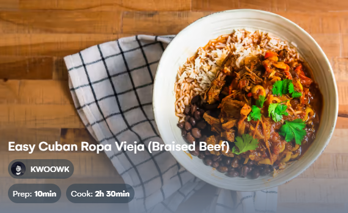

# Ropa Vieja

  

  

 

  

  

 

## Ingredients
| Ingredient | Quantity | Additional Notes |
| --- | --- | --- |
| Oil | 6 tbsp |
| Flank Steak | 3 lbs |
| Onion | 1 | white or yellow |
| Garlic | 1 entire head of cloves | minced |
| Bell Peppers | 2 | red and/or yellow |
| Marzano Mini Tomatoes | 1 bag | sliced in half (long ways) |
| Crushed Tomatoes | 28 oz can |
| Tomato Paste | 1 can |
| Beef Broth | 1.0 L |
| Salt | 1.5 tsp |
| Pepper | 1.5 tsp |
| Cumin | 3 tbsp |
| Oregano | 3 tbsp |
| Chipotles Peppers in Adobo Sauce | 1 can |
| Pimiento Stuffed Olives | 1/3 cup | 12-16 olives |

## Instructions
1. Cut your flank steak into big pieces to fit in your pot/dutch oven. Cut against the grain for easy shredding later.
1. Season with 1.5 tsp of salt & pepper and add to a high-heat pot/dutch oven coated with oil. Cook on both sides until just browned and remove the beef. Sear steak on all sides, then toss in pressure cooker.
1. Add in sliced onion and sliced bell pepper, along with some (sea) salt. Stir fry until the onions are soft. Then add minced garlic, stir for another minute or two, then add mixture to pressure cooker.
1. Deglaze dutch oven with beef broth and pour remaining into pressure cooker
1. Add oregano, cumin, tomato paste, crushed tomatoes, chipotle peppers, and beef broth to pressure cooker and cook meat medium (30 min) on high pressure
1. Take out beef and shred to pieces using two forks, then add shredded beef back in
1. Add in pimiento olives & marzano tomatos
1. Cook meat (low, 16 min) on high pressure
1. Serve with rice, black beans, and plantains
