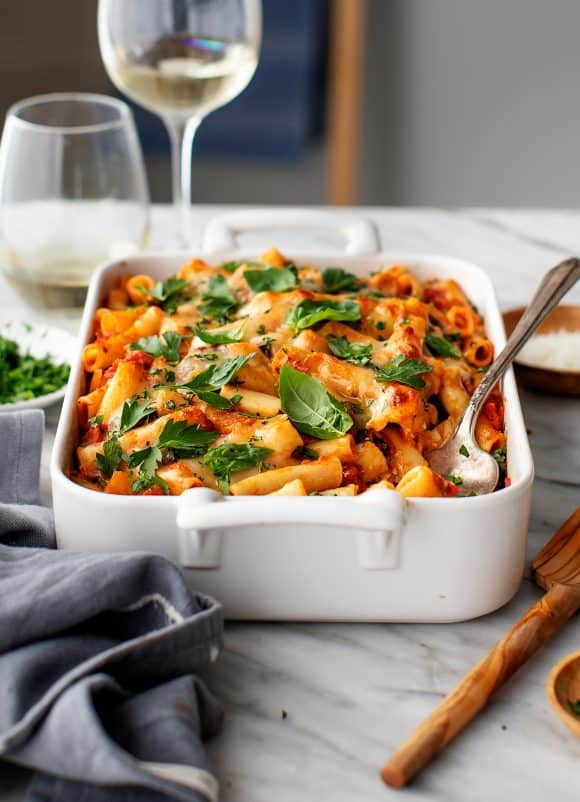

# Penne Lasagna Bake

  

  

 

  

 

## Ingredients
| Ingredient | Quantity | Additional Notes |
| --- | --- | --- |
| Pasta | 1 lb (1 box) | Ziti, Penne, or Rigatoni |
| Marinara Sauce | 4-6 cups (2 jars of sauce) | |
| Tomato Paste | 1 can |
| Ricotta Cheese | 2 cups (16 oz) |
| Garlic | 2 cloves | minced |
| Lemon Zest | 1 tbsp | grate 1 full lemon |
| Oregano | 1 tsp |
| Red Pepper Flakes | 1 tsp |
| Sea Salt | ½ tsp |
| Black Pepper | 1/4 tsp | ground |
| Olive Oil |
| Onion |
| Ground Beef |
| Spinach | 1 lb |
| Mushrooms | optional |
| Mozzarella Cheese | 1 ½ cups grated cheese |
| Parmesan Cheese | 1/4 cup grated cheese | and/or pecorino cheese |
| Parsley | optional garnish | chopped |
| Basil | optional garnish | torn basil leaves |

## Instructions
1. Preheat the oven to 425°F.
1. In a large pot of boiling water, add a splash of oil, cook the pasta according to package directions until al dente & drain.
1. In a medium bowl, combine the ricotta cheese, garlic, lemon zest, oregano, red pepper flakes, ½ teaspoon salt, and several grinds of fresh pepper.
1. Dice a quarter to half of an onion into cubes, then place the original large pot on medium heat. Add a splash of olive oil and sauté the onion. Once the onion is clear, add in ground beef, salt, pepper, and whichever other seasonings of your choice (italian herbs, oregano, garlic powder, etc.)
1. *Optionally* add in mushrooms once beef is cooked and sauté.
1. Once the beef is cooked, dump in all the marinara sauce and 1 can of tomato paste.
1. In a separate pot, boil water first, then add spinach for a minute or two until wilted, then drain the excess water, and chop into coarse pieces. Add this spinach to the marinara + pasta + meat mix.
1. Grab pyrex glass baking tray, and pour in half of the marinara + pasta + meat mix to create a base layer.
Add in the ricotta mix to create a second layer. Then top it off with the remaining marinara + pasta mix to create a third layer. Top with the mozzarella and/or pecorino cheese.
1. Bake until the cheese is browned, 16-22 minutes.
1. Garnish with fresh basil or parsley and serve hot.
