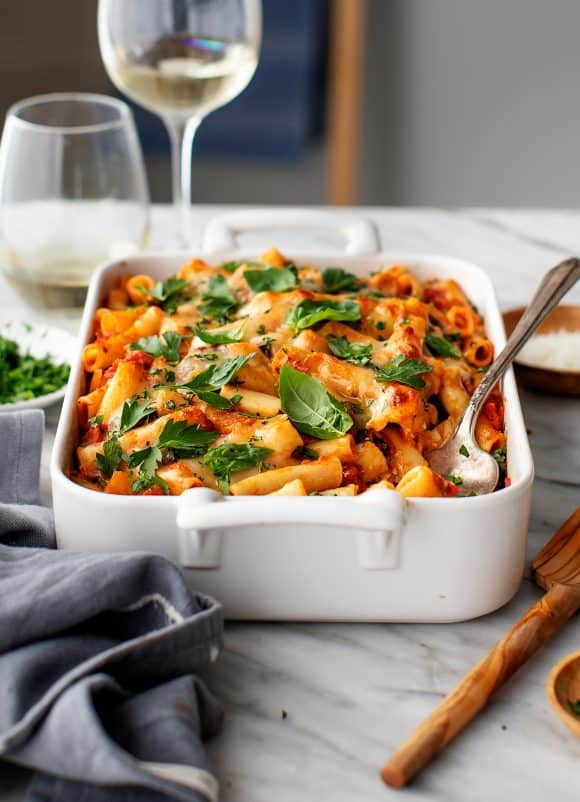

# Ziti / Penne Bake

  

  

 

  

 

## Ingredients
| Ingredient | Quantity | Additional Notes |
| --- | --- | --- |
| Pasta | 1 lb (1 box) | Ziti, Penne, or Rigatoni |
| Marinara Sauce | 4-6 cups (2 jars of sauce) | |
| Ricotta Cheese | 2 cups (16 oz) |
| Garlic | 2 cloves | minced |
| Lemon Zest | 1 tbsp |
| Oregano | 1 tsp |
| Red Pepper Flakes | 1/4 tsp |
| Sea Salt | 3/4 tsp | add additional salt to pasta water |
| Black Pepper | to taste | ground |
| Olive Oil | drizzle to preference |
| Spinach | 1 lb |
| Mozzarella Cheese | 1 1/2 cups grated cheese |
| Parmesan Cheese | 1/4 cup grated cheese | can use pecorino instead |
| Parsley | optional garnish | chopped |
| Basil | optional garnish | torn basil leaves |

## Instructions
1. Preheat the oven to 425°F. Spread ½ cup marinara in the bottom of a 9x13-inch baking dish.
2. In a medium bowl, combine the ricotta cheese, garlic, lemon zest, oregano, red pepper flakes, ½ teaspoon salt, and several grinds of fresh pepper.
3. In a large pot of salted boiling water, cook the pasta according to package directions until al dente. Drain.
4. Return the pot back to the stove. Over low heat, drizzle the bottom of the pot with a little olive oil and add the spinach. Toss and sauté 1 to 2 minutes until just wilted, working in batches if necessary. Turn off the heat, remove the spinach from the pot, and gently squeeze out some of the excess water. Coarsely chop it and set aside.
5. Add the pasta back to the pot along with the remaining marinara, most of the chopped spinach, ¼ teaspoon sea salt, and more fresh pepper and toss until combined.
6. Add half the pasta to the baking dish, top with dollops of the ricotta, the remaining spinach, and scoop the remaining pasta on top. Top with the mozzarella and pecorino cheese. Drizzle with olive oil and bake until the cheese is browned, 16 to 22 minutes.
7. Garnish with fresh basil or parsley and serve hot.
