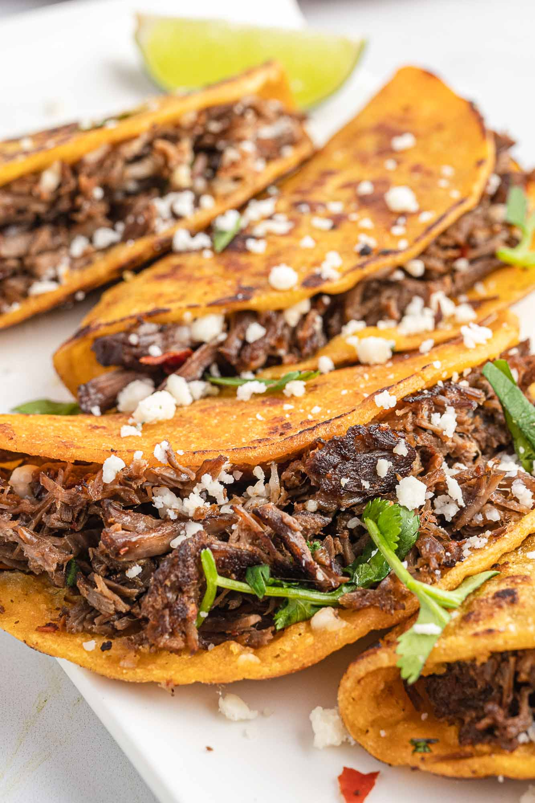

# Beef Birria Tacos

  

  

 

  

 

## Ingredients
| Ingredient | Quantity | Additional Notes |
| --- | --- | --- |
| Chuck Roast Beef | 2 lbs | sliced into squares |
| Beef Broth/Stock | 8 cups | or water |
| Garlic | 4 cloves |
| Onion | 1 | chopped into 3 or 4 parts |
| California Chiles | 5-6 | dried peppers |
| Onion Powder | 1 tsp |
| Garlic Powder | 1 tsp |
| Black Pepper | 1 tsp |
| Chili Powder | 1 tsp | *optional* |
| Sazón Goya *(Con Culantro y Achiote)* | 1 packet |
| Salt | 0.5-1 tsp |
| Bouillon Cubes | 2 big cubes | Knorr Caldo Con Sabor de Res |
| Bay Leaves | 4 big whole leaves |
| Corn Tortillas |
| Oaxaca Cheese |

## Instructions
1. Add all ingredients into a large pot
2. Let it simmer for about 2 hrs
3. After 2 hrs, spoon out the chiles and the onion, and blend it with some broth and add it back in
4. You should get a nice, rich colored broth in the pot, then let that simmer until meat is pull-apart tender
5. Add that meat to a bowl, sauce it up with the pot broth

### Making the Tacos
1. Dip one side of the tortilla in the pot broth
2. Place dipped tortilla on hot surface, add some cheese, throw the beef ontop, and add a bit more cheese
3. Fold and flip to cook both sides
4. Eat with pot broth on the side as dipping salsa
