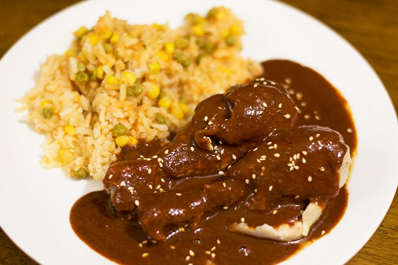

# Chicken Mole

  

  

 

  

 

## Ingredients:
Makes 7 servings  

| Ingredient | Quantity | Additional Notes |
| --- | --- | --- |
| New Mexico or Guajillo Chile Pods | 7 |
| Chile Pasilla | 1 |
| Onion | 1/2 small white onion |
| Roma Tomato | 1 |
| Mexican Chocolate Disk | 1/2 disk |
| Garlic Cloves | 4 |
| Bay Leaves | 2 |
| Salatine Crackers | 15 |
| Cinnamon Stick | 1 inch |
| Sesame Seeds | 1 tbsp |
| All Spice | 4 |
| Whole Cloves | 3 |
| Whole Cumin | 1/4 tsp |
| Chicken | 3 lbs |
| Doña Maria Mole Sauce | 1 jar | *optional* |

## Cook Chicken
1. In a large pot, add about 16 cups of water, set on high heat
2. Add salt, quarter of an onion, two bay leaves, and two garlic cloves
3. Once the water comes to a boil, throw in the chicken and cook it for 25-30 min

## [Clean the Chile Pods](https://youtu.be/EGv819tilcw?t=85)
1. Rub the chile pods with a damp paper towel to clean them
2. Remove the stem along with the seeds
3. Set them aside until ready to mix with the sauce

## Broth Processing
1. Skim the top of the bubbles in the chicken pot off and throw away
2. After 25 min, the chicken should be fully cooked and can be removed from the pot
3. Reserve 9 cups of the broth
4. Strain out 9 cups of broth, and dispose of the remaining broth
5. Return the reserved 9 cups back into the pot
6. Throw in the half chocolate circle into the pot

## Toasting the Spices
1. In a small frying pan, set heat to medium heat
2. Begin by toasting the sesame seeds. Once they change color, throw them into the blender
3. Next toast the cinnamon stick, allspice, cloves, and cumin. Toast for a few seconds and then transfer to blender
4. Add some oil into pan, and fry both sides of each chile for a few seconds, then transfer them to the broth pot (not the blender). This is to soften the chiles
5. Fry the remaining quarter onion, and garlic cloves until they've softened, then transfer to blender
6. Fry the saltine crackers on both sides, then transfer to blender (this is to thicken the sauce)
7. Lastly, fry the sides of the tomato until soft, then transfer to blender
8. Transfer the chile pods from the broth back to the blender
9. Add one jar of mole to blender
10. Transfer the broth back, and blend until you have a smooth sauce

## Cooking the mole
1. In a large pot, set to medium heat, and add a little bit of oil to prevent sauce from sticking to the pot.
2. Once hot, add the blended sauce
3. Whisk until sauce thickens up
4. Once it looks like it's about to simmer, taste test to see if it needs any salt.
5. Add the chicken back into the mole, and reduce heat to low
6. Cook for 10 minutes, and then serve & enjoy
