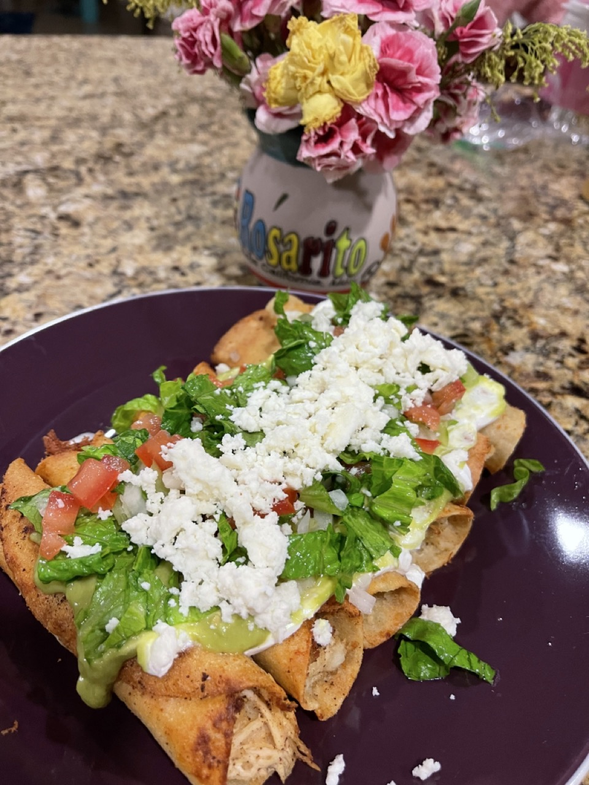

# Chicken Taquito Flautas

  

  

 

  

  

 

## Ingredients
**Note:** Makes 25~30 taquitos

| Ingredient | Quantity | Additional Notes |
| --- | --- | --- |
| White Corn Tortillas | 25 |
| Chicken Breast | 2 | large chicken breasts |
| Potatoes | 3 | large potatoes, match chicken breast volume |
| Queso Fresco or Queso Oaxaca | - | garnish amount of serving |
| Sour Cream | - | garnish amount of serving |
| Paprika | 1 tsp |
| Garlic powder | 1 tsp |
| Salt |  1 tsp |
| Adobo |  1.5 tsp |

### Ingredients for Salsa Verde
**Note:** Coats 10~15 taquitos
- Only make as much as you need at one serving

| Ingredient | Quantity |
| --- | --- |
| Chiles serranos | 1 chile |
| Onion | 1/4 white onion |
| Avocados | 1 |
| Salt | 1/2 tsp |
| Garlic Powder | 1/2 tsp |

### Ingredients for Pico de Gallo
**Note:** Coats 10~15 taquitos
- Only make as much as you need at one serving

| Ingredient | Quantity | Additional Notes |
| --- | --- | --- |
| Onion | 1/4 white onion | use less if there isn't enough tomato, match tomato in volume |
| Tomato | 1 | use the dry parts for pico de gallo, put tomato heart in the salsa verde |
| Lettuce | equal volume as tomato | chopped |
| Cilantro | - | optional |
| Lime Juice | 1 lime |

## Instructions
1. Boil chicken and peeled potatoes on high heat until fully cooked about 20-30 minutes.
    - Intermittently remove foam the collects at the surface of the water.
    - Chicken will likely cook in about 25 min, take it out and leave potato to cook more so it is softer
2. Allow to cool slightly, shred chicken and season to taste with paprika, adobo, garlic powder, salt.
3. Add potatoes and mix thoroughly.
4. Heat up tortillas in microwave until soft
    - *My mom's method:*
        - Place 5~10 tortillas in a ziplock bag (sandwich sized) and put a couple droplets of water in the bag as well
        - Heat for ~30 seconds
4. Roll the taquitos with the chicken-potato filling
5. Seam side down, cook in hot oil for few minutes until golden and crispy on all sides
6. Place taquitos on paper towels to drain oil

## Salsa Verde Instructions
1. Fry chiles serranos and onion
2. Place in a blender (with residual oil) along with avocado, tomato heart, salt, and garlic powder
3. Blend until creamy

## Garnishments
1. Finely chop garnishment ingredients and place in a bowl
2. Add lemon juice and mix well

## Dish Presentation
1. Place 3-6 flautas on dish
2. Glaze with the sour cream
3. Plop the guacamole blend onto the center of all the flautas and spread evenly
4. Garnish with Pico de Gallo and fresh cheese crumbs (Oaxaca or Queso Fresco)
