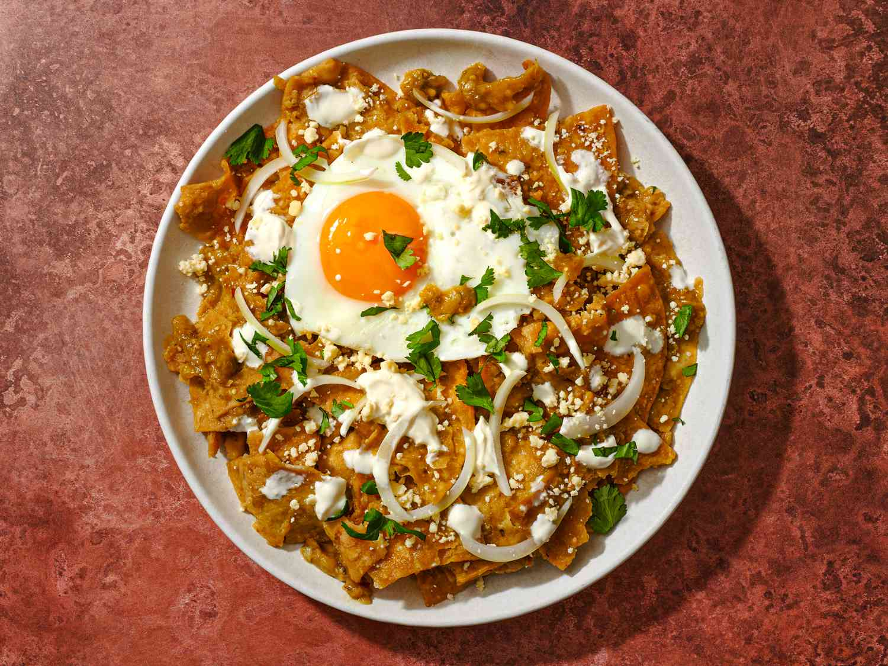

# Chilaquiles

  

Rating: :star::star::star::star::star: /5  
- 15 :corn: Tortillas
- Vegetable Oil
- Shredded Cheese
- 5 Roma :tomato:
- 1-2 Jalapeños or 1-1.5 Serrano Chile Peppers
- 2 Chile Arbol Leaves (dried pepper)
- 1/4 Onion sliced into moons
- 2 Garlic cloves
- 1/4 tsp Whole Cumin
- 1/4 tsp Ground Black Pepper
- 1/4 tsp Salt

## Fry Tortillas
1. Cut tortillas into small triangles
2. Cover pan with oil and set to medium heat
3. Fry tortilla chips until golden and strain excess oil from them

## Making the Chile Salsa
1. Roast tomato's, chiles, garlic (lightly toasted chile de arbol)
2. Transfer over to blender and add cumin, black pepper, & salt
3. Blend to make salsa
4. Pour two tbsp of tortilla oil to fry oins for a few minutes
5. Add salsa to onion stir and add 1/4 cup of water to rinse out blender into the pan
6. Stir and let come to a simmer, try it to see if it needs more salt, then let simmer for 2 minutes

## Final Product
1. Add tortilla chips & turn up heat to preserve crunch, mix evenly for a few minutes
2. (Optional) Add cooked shredded beef or pork
3. Cover with diced or shredded cheese & cover to let the heat melt the cheese
4. (Optional) Cover with sunny-side-up egg
5. (Optional) Serve with sliced avocado
