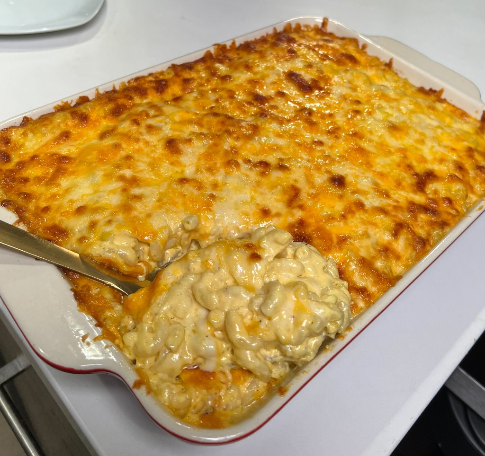

# Creamy Mac & Cheese

  

  

 

  

  

 

## Ingredients
| Ingredient | Quantity | Additional Notes |
| --- | --- | --- |
| Elbow Pasta Noodles | 1.5 boxes | 24 oz of noodles, can use cavatappi |
| Sharp Cheddar | 16 oz | Tillamook recommended |
| Colby Jack Cheese | 16 oz |
| Gouda | 8 oz |
| Mozarella | 8 oz |
| Heavy Cream | 6 cups |
| Salted Butter | 4 tbsp |
| Cream Cheese | 4 oz | *optional* |
| Chicken Bouillon | 1 cube |
| Salt | 0-1 tsp |
| Onion Powder | 1 tsp |
| Ground Mustard | 1 tsp |
| White Pepper | 1 tsp |
| Adobo | 1 tsp |

## Instructions
1. Grate your cheeses using a shredder and set them aside. If you come across any small chunks that are too petite to grate, set them aside to save them for later.
1. Cook your macaroni noodles following the instructions on the package. Enhance the water with chicken bouillon for added flavor.
1. In a spacious sauce pot, melt butter on low heat, and gradually pour in the heavy cream. Whisk the mixture smoothly.
1. Gradually incorporate approximately **50%** of your shredded cheeses until well blended. Introduce cream cheese last, allowing the cheese to melt and simmer on low heat.
1. Taste the cheese sauce and if needed, season cheese sauce with salt, onion powder, ground mustard, white pepper and adobo. Taste to perfection. Cheese sauce should look wet & creamy.
1. Begin ladeling the cheese sauce over the cooked elbow noodles and set **25%** cheese sauce aside to be used for coating the 2 layers.
1. Toss in the small extra chunks of cheese. Aim for a creamy, wet mixture that produces a satisfying sound when mixed.
1. Grab a 13x9 baking dish, remember we are making two layers, and start the first layer with half of your noodles, & layer with a coating of cheese sauce and shredded cheese.
1. Make a second layer by adding the remaining noodles and finish by topping with a generous layer of shredded cheese & cheese sauce.
1. If more cheese is needed for the top, opt for cheddar or colby jack.
1. Bake at 350°F until the cheese is melted.
1. Broil for 2 minutes at the end for a nice golden brown top.
