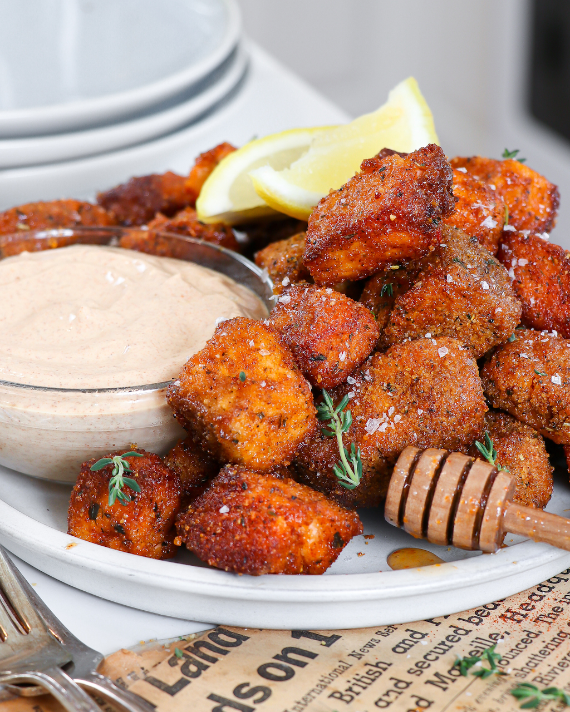

# Crispy Hot Honey Salmon Bites

  

Rating: ? /5  
[Instagram Link](https://www.instagram.com/reel/CrTkE0nATGs/?igshid=MzRlODBiNWFlZA%3D%3D)  
[Recipe Link](https://www.abrightmoment.com/recipes/air-fryer-crispy-hot-honey-salmon-bites)  

## Ingredients
*Servings: 2*
- Salmon (2 fillets, skin removed)
- Olive Oil (1 tbsp)
- Garlic Powder (1 tsp)
- Dried Italian Herb Seasoning (1 tsp)
- Salt (1 tsp)
- Sweet Paprika (2 tsp)
- Panko Breadcrumbs (1/2 cup)
- Honey (1/4 cup)
- Hot Sauce (1-2 tbsp)

### "Healthy" Homemade Chipotle Sauce
- Plain Greek Yogurt (1/2 cup)
- Mayonnaise (1/4 cup)
- Chipotle Pepper (1, from canned chipotles in adobo sauce)
- Garlic Clove (1, peeled)
- Lime Juice (1 lime)
- Olive Oil (1 tbsp)
- Salt & Pepper (to taste)

## Instructions
1. Combine the panko breadcrumbs and all seasonings into a large container or bowl.
1. Slice the salmon into bite sized pieces. Add to the mixture and toss to coat the salmon in the mixture.
1. *If you want them extra crispy:* dip the salmon bites in a beaten egg and then into more pankocrumbs.
1. *For extra color:* Sprinkle with more paprika
1. Add to your air fryer and drizzle with olive oil
1. Bake at 380°F for 4-5 min, flip and cook for another 4-5 min
1. In a small bowl, mix the honey and hot sauce together. Add to the cooked salmon bites and toss to coat.
1. To make the chipotle sauce, simply combine all ingredients into a food processor to blend until smooth.
1. Enjoy warm!
