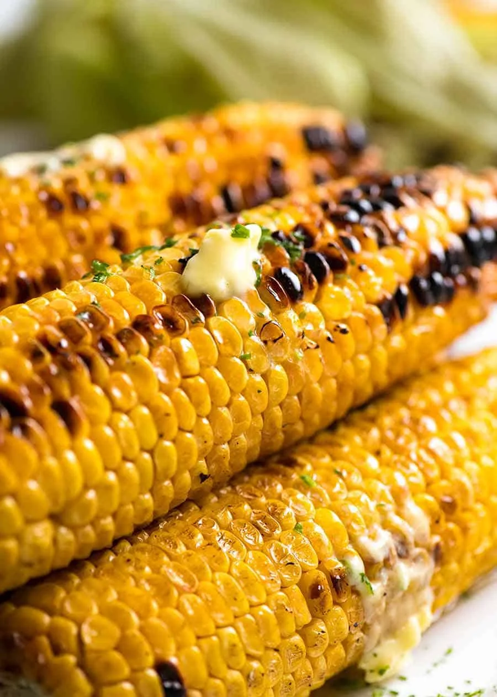

# Corn On The Cob

  

  

 

  

 

## Ingredients
| Ingredient | Quantity | Additional Notes |
| --- | --- | --- |
| Corn | 2 |
| Butter | 1 tbsp | Softened/melted butter |

## Instructions
1. Preheat BBQ until hot.
1. Peel husk off the corn & wash
1. Place corn on the BBQ (no oil required).
1. Cook for 10-20 minutes (depending on heat), turning every couple of minutes, until there's little charred bits and the kernels are tender when pierced with a knife, but still juicy
1. In the last minute, brush with melted butter and roll around.
1. Sprinkle with parsley if desired
