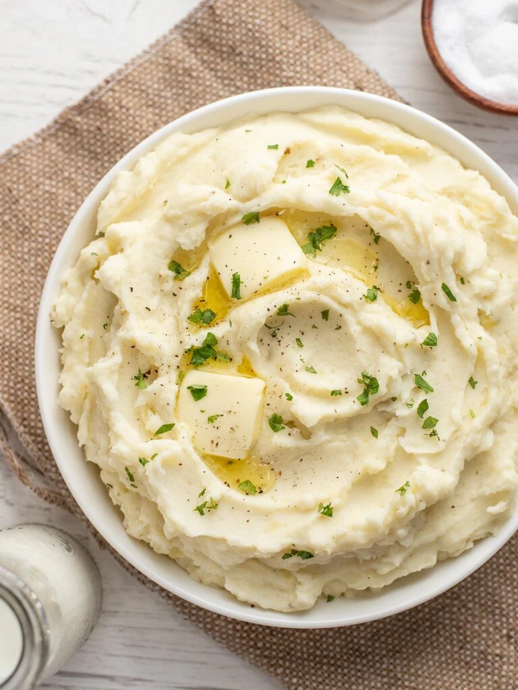

# Mashed Potatoes

  

  

 

  

 

## Ingredients
| Ingredient | Quantity | Additional Notes |
| --- | --- | --- |
| Potatoes | 2.5 lbs | Russet or Yellow or Yukon |
| Salt | ½ tsp | to salt the boiling water |
| Butter | 4 tbsp |
| Whole Milk | ½ cup |
| Salt | ½ tsp | or to taste |
| Pepper | ¼ tsp |
| Garlic Powder | ¼ tsp |

## Instructions
1. Peel and dice the potatoes into 1-inch cubes. Place the diced potatoes in a colander and rinse well with cool water to remove the excess starch.
1. Place the rinsed potatoes in a pot and add fresh water until the potatoes are covered by one inch. Add ½ tsp salt to the water in the pot.
1. Place a lid on the pot and bring the water up to a boil. Boil the potatoes for 6-7 minutes, or until they are very tender (a fork can pierce the potato effortlessly).
1. Drain the potatoes in a colander and rinse again briefly with warm water to remove more excess starch in order to get fluffy mashed potatoes as the end result.
1. While the potatoes are draining, add the butter and milk to the pot used to boil the potatoes. Heat them over medium until the butter has melted.
1. Add the drained potatoes back to the pot and mash with a potato masher or similar cooking utensil.
1. Season the potatoes with ½ tsp salt and ¼ tsp pepper and ¼ tsp garlic powder (possibly use more salt if unsalted butter was used).
1. For extra smooth and fluffy mashed potatoes, use a hand mixer to whip the potatoes until there are no lumps and they are light and cloud-like. Serve and enjoy!

## Nutrition
| Name | Amount |
| - | - |
| Serving | 1 cup |
| Calories | 274 kcal |
| Carbohydrates | 42g |
| Protein | 6g |
| Fat | 10g |
| Sodium | 441mg |
| Fiber | 3g |

## What else can be added?
Here are some ideas for other ingredients to add additional flavor:
- Sour cream
- Cream cheese
- Cheddar cheese
- Bacon
- Green onion
- Chives
- Blue cheese
- Parmesan
- Caramelized onions
- Smoked paprika
- [Roasted garlic](https://www.budgetbytes.com/roasted-garlic/)
- [Ranch seasoning](https://www.budgetbytes.com/homemade-ranch-seasoning-mix/)
- [Garlic herb seasoning](https://www.budgetbytes.com/all-purpose-garlic-herb-seasoning/)
